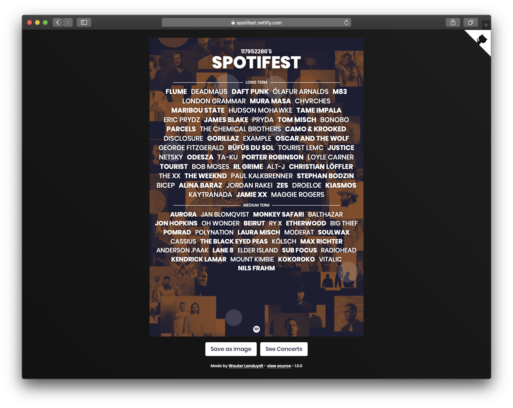

# Spotifest [](https://app.netlify.com/sites/spotifest/deploys)

[Spotifest](https://spotifest.netlify.com) is a web application that uses **Spotify data to generate your ideal festival poster**. After the user successfully logged in with his Spotify cridentials it shows a poster with his top artists.

You can change the time range and artist ordering of the poster. Data will be more accurate if you're a frequent Spotify user.



## Technologies

- [create-react-app](https://github.com/facebook/create-react-app) - Used as boilerplate
- [Spotify Web API](https://developer.spotify.com/documentation/web-api/) - To authenticate and get top artist data

## How to run locally

```
$ git clone https://github.com/wouterlanduydt/Spotifest.git
$ cd Spotifest/
$ yarn
$ yarn start
```

## Extra

The user can save a Spotify playlist with song recomendations based on his top artists.

## Credits

- [spotify-web-api-js](https://github.com/JMPerez/spotify-web-api-js)
